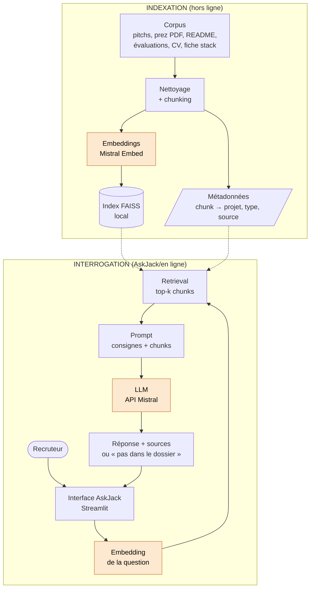

```mermaid
flowchart TB
    subgraph IDX["INDEXATION (hors ligne)"]
        direction LR
        A["Corpus<br/>pitchs, prez PDF, README,<br/>évaluations, CV, fiche stack"] --> B["Nettoyage<br/>+ chunking"]
        B --> C["Embeddings<br/>Mistral Embed"]
        C --> D[("Index FAISS<br/>local")]
        B --> M[/"Métadonnées<br/>chunk → projet, type, source"/]
    end

    subgraph QRY["INTERROGATION (AskJack/en ligne)"]
        direction LR
        U(["Recruteur"]) --> S["Interface AskJack<br/>Streamlit"]
        S --> E["Embedding<br/>de la question"]
        E --> R["Retrieval<br/>top-k chunks"]
        R --> P["Prompt<br/>consignes + chunks"]
        P --> L["LLM<br/>API Mistral"]
        L --> O["Réponse + sources<br/>ou « pas dans le dossier »"]
        O --> S
    end

    D -.-> R
    M -.-> R

    classDef ext fill:#fde8d0,stroke:#c77b30,color:#000;
    class C,E,L ext;
```
